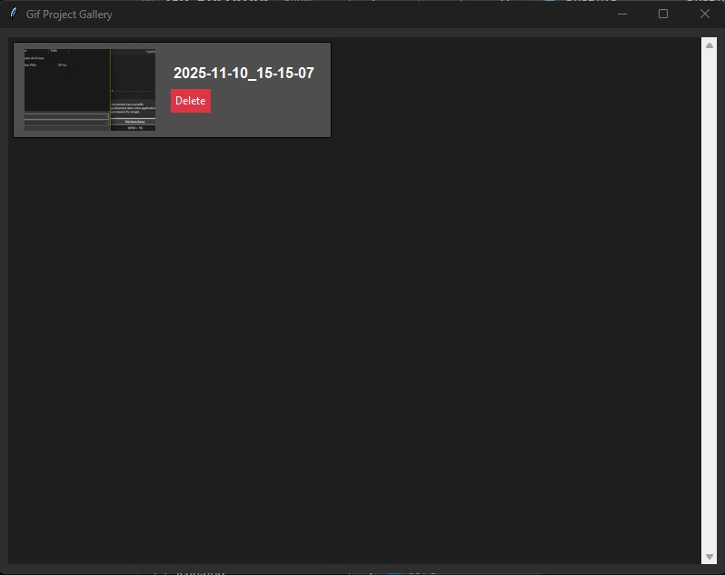
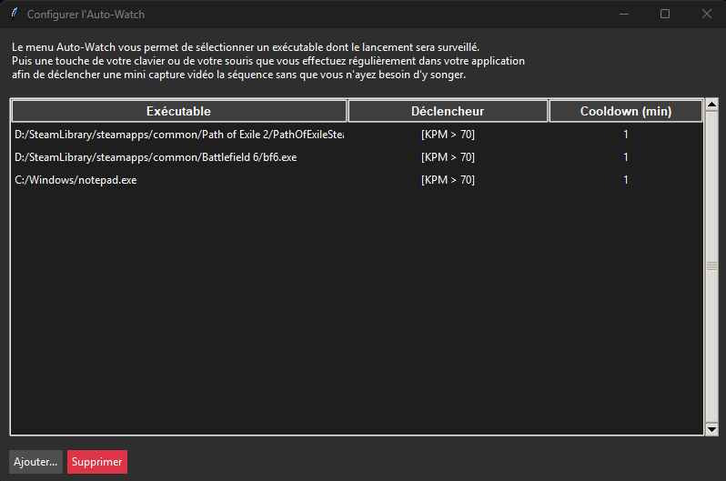
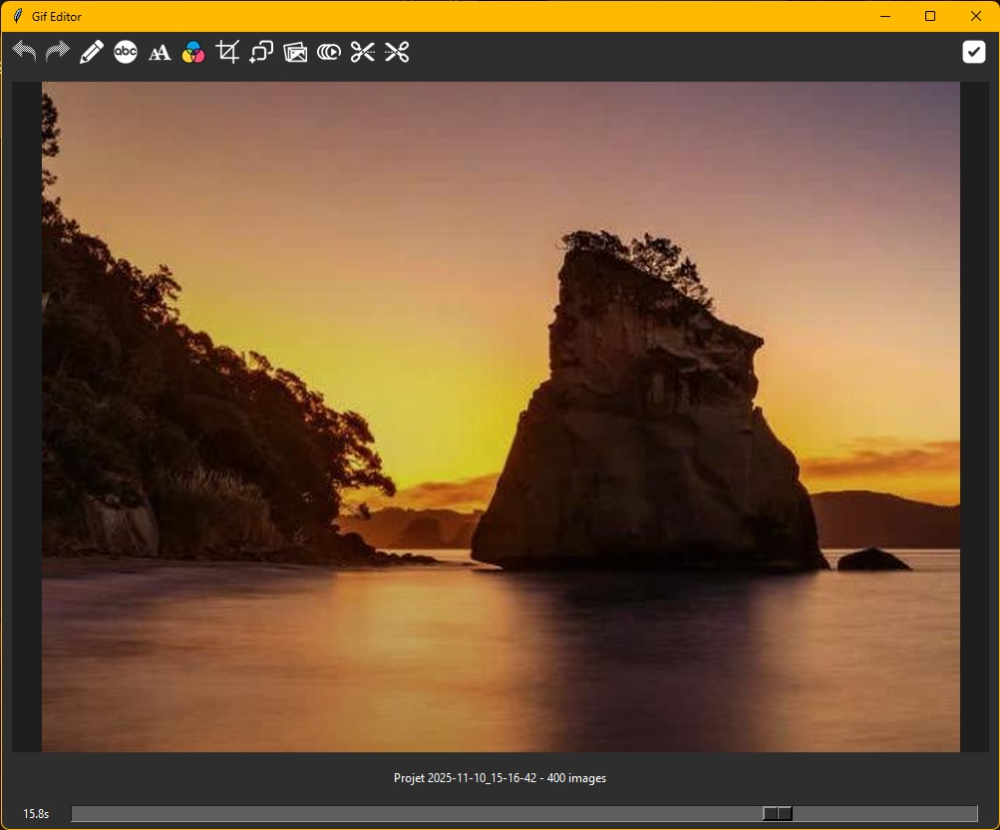

# Gif-Recorder

Gif Recorder &amp; Editor is a comprehensive Windows application designed for effortless screen capture and GIF creation. This suite consists of two main components: a powerful background recorder for capturing screen activity and a feature-rich editor for annotating and finalizing your GIFs.

# Menu GIF RECORDER

Lancez Gif Recorder.exe
Avant toute chose , pensez à définir le répertoire de conservation des fichiers des projets (depuis le menu TrayIcon, c'est à dire le petit menu du click droit sur l'icone d'un appareil photo bleu de la barre des notifications de Windows à coté de l'horloge).

Maintenant , Faites Shift+F12 a tout moment pour capturer une zone de l'écran (Ou faites Echape pour annuler)
Sélectionnez la partie de l'écran dont vous désirez capturer les 20 dernières secondes (ou plus si vous le sélectionnez dans le menu TrayIcon).
Après un cours instant , une fenêtre de gestion de partage apparait.

Vous pouvez aussi cliquer sur l'icone de l'œil (si vous l'avez affiché depuis le menu TrayIcon) pour capturer tout l'écran instantanément sur cette même période de temps passé , 
mais la fenetre de gestion de projet ne s'ouvrira pas (plus rapide en plein jeu par exemple).
Vous pourrez acceder malgré tout à cette fenetre de projet depuis le menu TrayIcon.

Dans cette fenetre de gestion de projet , vous pouvez Selectionner une des captures précédentes ou les supprimer.
Si vous clickez sur un des projets , Gif Editor se charge …

Vous pouvez également modifier l'écran de selection ! (Monitor)

Mode Auto-Watch : Vous pouvez choisir certains programmes pour lesquels valider un déclancheur automatique de capture ! ca s'appel : AutoWatch.
Si vous faites ainsi , lorsque vous lancez le logiciel correspondant , GifRec attendra un des déclancheurs que vous aurez sélectionné.
Soit une touche de clavier , soit de la souris , soit une exitation de votre activité Clavier/Souris (appelé Key Per Minutes) , au dessus d'un seuil tel que 100 Kpm , 200 Kpm…
Vous devrez également choisir un temps minimum entre deux captures effectués par cette méthode.

# Menu GIF EDITOR

Vous voyez : UNDO / REDO / CRAYON / TEXT / TAILLE DE TEXTE / COULEUR / CROP / DUPLICATE IMAGE / SUPPR IMAGE / SLOW MOTION / COUPER DEBUT / COUPER FIN / VALIDER
Vous voyez un curseur de TimeLine pour vous déplacer dans le temps …

Undo : Annuler la derniere action
Redo : Rétablire la derniere action
Crayon : permet de rajouter une annotation qui apparaitra pendant 1 seconde à partir de l'instant où vous vous trouvez dans la TimeLine. (Vous pouvez mettre plusieurs annotations différentes)
Texte : Pour ajouter du texte (qui apparaitra aussi pendant 1 seconde à partir de l'instant choisis). Le texte est posé en haut à droite du curseur croix précisément.
Taille de Texte : Définir la taille du texte
Couleur : Choisir la couleur du Crayon ou du Texte.
Crop : Définir une zone de selection de l'image
Duplicate Image : Dupliquer l'image sur laquelle vous êtes (Parfait pour faire une pause)
Suppr Image : Supprimer l'image sur laquelle vous êtes
SlowMo : Ralenti progressivement la séquence jusqu'à l'image où vous êtes puis accélère progressivement la séquence pour un effet "Whaou". Idéal pour marquer une notif plus spécifiquement
Couper le Debut : Supprimer les 3 premières images (répétable à volonté)
Couper la fin : Supprimer les 3 dernières images (répétable à volonté)
Valider : permet de confirmer les modifications que vous avez faites sur ce GIF.

A ce moment là , il vous propose soit de garder la version originale , soit de le compresser (légèrement altéré pour 35% d'économie de place).

Vous pouvez Maintenant faire Coller où vous voulez.
Soit dans une fenêtre de conversation Sociale (Facebook / Instagram … etc , pour un Maximum de 100 mo , vérifiez dans la fenetre de Validation d'abord)

Soit même dans l'explorateur Windows (sous forme d'un fichier Gif pour le conserver)
Vous pouvez voir sur la TimeLine les Notifs ajoutés.

PS : Vous pouvez rouvrir l'éditeur à tout moment facilement , il suffit d'aller dans le Menu de la TrayIcon et de cliquer sur "Gif Editor".
N'oubliez pas également que si vous n'avez pas copié sous forme de fichier GIF le contenu dans votre Explorateur Windows , le "clip" est supprimé dès que vous fermez le programme. Il n'a pas d'autre mémoire que vos propres actions.
Voilà ! En espérant que ce petit logiciel vous apporte plein d'amour !

Information pour les développeurs :
Attention, GIF Recorder ne fonctionne que sous Windows. Impossible de le recompiler à partir des Sources pour Linux ou Android car il utilise des Bibliothèques DLL propres à Microsoft (Python_DXCam).
